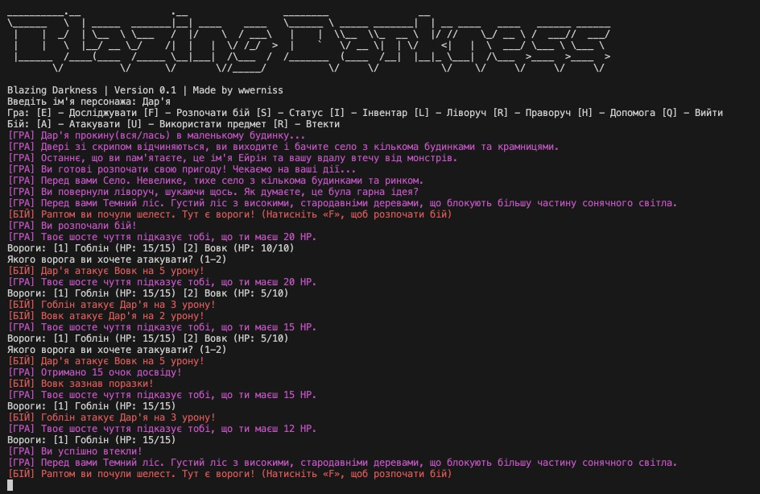

# Blazing Darkness
A console RPG with turn-based combat and procedural generation elements.

You are the one who survived after fleeing your hometown — a name you’ve forgotten due to trauma. The only things you remember are the name Eirin and the taste of ash on your tongue. The village where you woke up is a border settlement on the edge of the Dark Forest, where scouts from the Flame Guild have recently been disappearing.


[Mechanics [EN]](./docs/mechanics_en.md) | [Mechanics [UA]](./docs/mechanics_ua.md) | [Technical details [EN]](./docs/documentation_en.md) | [Technical details [UA]](./docs/documentation_ua.md)



## Prerequisites

- CMake (version 3.10 or higher)
- C++17 compatible compiler
- Unix-like system (Linux, macOS, or WSL) (Windows is not tested)

## Building

```bash
chmod 777 ./tools/build.sh 
./tools/build.sh
```

## Running

After building, run the executable:

```bash
./build/BlazingDarkness
or
chmod 777 ./tools/run.sh 
./tools/run.sh
```

## Controls

#### In game
- `Q`: Quit the game
- `S`: Show status
- `E`: Explore location
- `F`: Fight enemies
- `I`: Inventory
- `L`: Move to the left location
- `R`: Move to the right location
- `Q`: Quit game
- `H`: Show help

#### In battle

- `A`: Attack
- `U`: Use item
- `R`: Run

## Project Structure

- `main.cpp`: Entry point of the application
- `CMakeLists.txt`: Build configuration
- `src/`: Source code directory
- `src/common/`: Common code directory
- `src/entities/`: Entities code directory
- `src/items/`: Items code directory
- `src/world/`: World code directory
- `tools/`: Tools directory
- `docs/`: Documentation directory

## Resources that we using

- [CMake](https://cmake.org/) - For building the project
- [Doxygen](https://www.doxygen.nl/) - For generating documentation
- [Git](https://git-scm.com/) - For version control
- [GitHub](https://github.com/) - For hosting this repository
- [GitHub Copilot](https://github.com/features/copilot) - For code completion
- [AnciiArt generator](https://patorjk.com/software/taag/#p=display&f=Graffiti) - For generating ASCII art
- [ChatGPT](https://chat.openai.com/) - For generating documentation, minimal/routine code, some refactoring code, some terminal ui solutions code
- [StackOverflow - How can I convert a std::string to int?](https://stackoverflow.com/questions/7663709/how-can-i-convert-a-stdstring-to-int)

## License

This project is open source and available under the [MIT License](LICENSE).